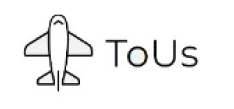

## 🗂️ Project

  <a href="https://github.com/Lotusrious/seoro-project">
    
    
<b>Seoro</b>

  </a>
    
  <a href="https://github.com/Lotusrious/SayKO">
    
    
<b>SayKO</b>

  </a>
    
  <a href="https://github.com/Lotusrious/ToUs">
    
    
<b>ToUs</b>

  </a>

  

## 💻 Tech Stacks

  
  
  
   
  
  
  
   
  

  

## 🛠️ Tools

  
  
  
  
   
  
  
  

  

## 📧 Contact

  

